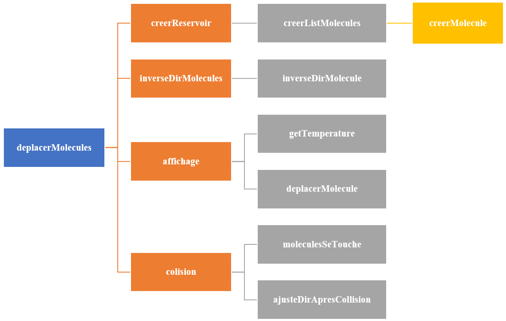
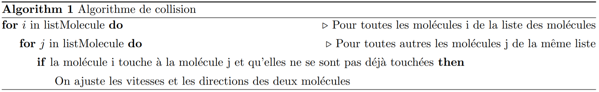

  

# Projet 2: Structures de données, fonctions
- [Directives particulières](#directives)
- [Énoncé de travail](#enonce)
- [Structure de données](#structure)
  - [Structure de données d'une molécule](#molécule)  
  - [Structure de données d'un réservoir](#reservoir)
- [Modules à implémenter](#module)
  - [Module molécule](#moleculem) 
  - [Module réservoir](#reservoirm)
- [Barème](#bareme)
- [Annexe: Guide et normes de codage](#annexe)

:alarm_clock: [Date de remise le Dimanche 31 Octobre 23h59][0]

## Directives particulières 
* Respecter [guide de codage](https://github.com/INF1007-Gabarits/Guide-codage-python) et les normes pep8;
* Noms de variables et fonctions adéquats (concis, compréhensibles);  
* Pas de librairies externes autres que celles déjà importées;  
* Dans chaque programme, vous pouvez ajouter d’autres fonctions à celles décrites dans l’énoncé pour améliorer la lisibilité.

## 1. Énoncé de travail 

Un gaz est constitué de molécules libres en mouvement. La température d’un gaz est une mesure de l’énergie cinétique moyenne des molécules. Plus une molécule va vite, plus son énergie cinétique est grande. 

Lorsqu’une molécule en frappe une autre, elle peut lui donner une partie de son énergie cinétique. Ce transfert d’énergie est appelé, à notre échelle, de la chaleur. Dans un environnement fermé (tel un réservoir), il y a conservation de l’énergie totale ; lorsque deux molécules se frappent, aucune énergie n’est perdue vers l’extérieur. On peut voir les molécules comme des boules de billard qui s’entrechoquent. 

Si nous enfermons un gaz d’un côté d’un réservoir séparé par une paroi et un autre gaz de l’autre côté, la température des deux côtés tendra vers l’égalité. En effet, la chaleur se transmettra par la paroi si deux molécules frappent la paroi, en même temps et au même endroit, de chaque côté.

Votre travail consiste à écrire un programme qui simule ce comportement. Donc, dans un réservoir séparé par une paroi, on verra plusieurs molécules qui s’entrechoquent et qui se transmettent leur énergie. 

Dans ce qui suit, nous expliquons les différents concepts.

## 2. Structure de données  

 Nous implémenterons deux dictionnaires. Le premier représente une molécule et l’autre le réservoir séparé par une paroi qui contient les molécules. Le détail de ces dictionnaires ainsi que les calculs nécessaires à la simulation vous sont présentés dans les prochaines sections.

### 2.1. Structure de données d'une molécule 

 Une molécule est représentée par un dictionnaire de cinq clés:

<ol><ul>
<li> <b> x</b>  : position en x de la molécule</li>
<li> <b> y</b>  : position en y de la molécule</li>
<li> <b> dx</b> : vitesse de déplacement en x de la molécule</li>
<li> <b> dy</b> : vitesse de déplacement en y de la molécule</li>
<li> <b> r</b>  : rayon de la molécule</li>
</ul></ol>

### 2.2. Structure de données d'un réservoir  

Un réservoir est représenté par un dictionnaire de sept clés:

<ol><ul>
<li> <b>h</b>      : hauteur du réservoir</li>
<li> <b>l</b>      : largeur du réservoir</li>
<li> <b>posPar</b> : position de la paroi</li>
<li> <b>mG</b>     : liste qui contient les molécules de la partie gauche du réservoir</li>
<li> <b>mD</b>     : liste qui contient les molécules de la partie droite du réservoir </li>
<li> <b>lCG</b>    : liste des collisions de la partie gauche du réservoir</li> 
<li> <b>lCD</b>    : liste des collisions de la partie droite du réservoir </li>
</ul></ol>

## 3. Modules à implémenter 

La figure 1 représente l'arbre des appels de fonctions à implémenter.

  
     
    <em><b>Fig. 1 :Arbre des appels de fonctions.</b></em>

### 3.1. Module molécule: 

<dl>
  <dt>3.1.1. creerMolecule(x, y, dx, dy, rayon):</dt>
  <dd>
Crée une molécule. La fonction reçoit la position <b>(x, y)</b> de la molécule, ça vitesse <b>(dx, dy)</b> et son <b>rayon</b>. La fonction renvoie un dictionnaire.
</dd>
	
  <dd><b>Paramètres:</b></dd>
		<ol><ul>
			<li><b> x[1x1]</b>: position en x de la molécule.</li>
			<li><b> y[1x1]</b>:  position en y de la molécule.</li>
			<li><b> dx[1x1]</b>: vitesse de déplacement en x de la molécule.</li>
			<li><b> dy[1x1]</b>: vitesse de déplacement en y de la molécule.</li>
			<li><b> rayon[1x1]</b>: rayon de la molécule.</li>
  	</ul></ol>
	<dd><b>Renvoie:</b></dd>
		<ol><ul>
			<li><b>molecule[1x1]</b>: un dictionnaire de type molécule.</li>
  	</ul></ol>
</dl>	

-------------------------------------------------------------------------------------------------------------------------------------------------------
<dl>
  <dt> 3.1.2. moleculesSeTouche(mol_1,mol_2):</dt>
  <dd>
On dit que deux molécules se touchent si la distance <b>d</b> entre elles est plus petite ou égale à la somme des rayons des deux molécules. On assume ici que les molécules n’ont pas le même rayon. 
</dd>
	

	
  <dd>
La fonction renvoie vrai si les deux molécules se touchent faux sinon.
</dd>
	
  <dd><b>Paramètres:</b></dd>
		<ol><ul>
			<li><b>mol_1[1x1]</b>: dictionnaire de type molécule.</li>
			<li><b>mol_2[1x1]</b>: dictionnaire de type molécule.</li>
  	</ul></ol>
<dd>
<code> <b>Note:</b> Valide que les deux molécules reçues en paramètre sont des dictionnaires de type molécule.</code>
</dd>
</dl>	

-------------------------------------------------------------------------------------------------------------------------------------------------------
<dl>
  <dt>3.1.3. deplacerMolecule(mol):</dt>
  <dd>
 On déplace une molécule simplement en ajoutant la vitesse à la position <b>(x + dx et y + dy)</b>. 
</dd>
  <dd><b>Paramètres:</b></dd>
		<ol><ul>
			<li><b>mol[1x1]</b>: dictionnaire de type molécule.</li>
  	</ul></ol>
	<dd><b>Renvoie:</b></dd>
		<ol><ul>
			<li><b>mol[1x1]</b>: dictionnaire de type molécule.</li>
  	</ul></ol>
<dd>
<code> <b>Note:</b> Valide que la molécule reçue en paramètre est un dictionnaire de type molécule.</code>
</dd>
</dl>	

-------------------------------------------------------------------------------------------------------------------------------------------------------
<dl>
 <dt> 3.1.4. ajusteDirApresCollision(mol_1, mol_2):</dt>
  <dd>
Nous vous offrons le code de cette fonction qui provient du WEB et que j’ai adaptée. Vous ne devez pas la modifier. 
</dd>
  <dd><b>Paramètres:</b></dd>
		<ol><ul>
			<li><b>mol_1[1x1]</b>: dictionnaire de type molécule.</li>
			<li><b>mol_2[1x1]</b>: dictionnaire de type molécule.</li>
  	</ul></ol>
	<dd><b>Renvoie:</b></dd>
		<ol><ul>
			<li><b>mol_1[1x1]</b>: dictionnaire de type molécule.</li>
			<li><b>mol_2[1x1]</b>: dictionnaire de type molécule.</li>
  	</ul></ol>
</dl>	  

-------------------------------------------------------------------------------------------------------------------------------------------------------

<dl>
 <dt> 3.1.5.creerListMolecules(hauteur,xmin,xmax,nbMolecules):</dt>
  <dd>
Crée une liste de molécules. La fonction reçoit la hauteur du réservoir, la position x minimale et maximale et le nombre de molécules a créé. Vous pouvez générer les positions <b>(x, y)</b>, les vitesses <b>(dx, dy)</b> et le rayon des molécules aléatoirement. Plus les vitesses sont rapides, moins l’affichage est réaliste. Plus les vitesses sont lentes, moins elles se stabiliseront rapidement.

</dd>
  <dd><b>Paramètres:</b></dd>
		<ol><ul>
			<li> <b>hauteur[1x1]</b>      : hauteur du réservoir</li>
			<li> <b>xmin[1x1]</b>      : position x minimale</li>
			<li> <b>xmax[1x1]</b> : position x maximale</li>
			<li> <b>nbMolecules[1x1]</b> : nombre de molécules a créé</li>
  	</ul></ol>
	<dd><b>Renvoie:</b></dd>
		<ol><ul>
			<li> <b>molecules[1xnbMolecules]</b>: liste qui contient les molécules générées aléatoirement </li>
  	</ul></ol>
</dl>	

<dl>
	
-------------------------------------------------------------------------------------------------------------------------------------------------------
<dl>
<dt> 3.1.6.inverseDirMolecule(mol, paroiG, paroiD, hauteur):</dt>
  <dd>
Si une molécule touche à une paroi extérieure ou intérieure, il faut que la molécule rebondisse. On sait si une molécule sort du réservoir si sa position en <b>x ou en y ± rayon</b> est hors limite. Par exemple, après un déplacement, si <b>x–rayon <= paroiG</b> alors il faut repositionner <b>x</b> sur le bord de la paroi et changer le signe de <b>dx</b>. Même chose pour la paroi de droite et même chose en <b>y</b> avec le haut et le bas.
</dd>
	  <dd><b>Paramètres:</b></dd>
		<ol><ul>
			<li> <b>mol[1x1]</b>      : dictionnaire de type molécule</li>
			<li> <b>paroiG[1x1]</b>      : paroi gauche</li>
			<li> <b>paroiD[1x1]</b>      : paroi droite</li>
			<li> <b>hauteur[1x1]</b> : hauteur du réservoir</li>
  	</ul></ol>
	<dd><b>Renvoie:</b></dd>
		<ol><ul>
			<li> <b>mol[1x1]</b>: dictionnaire de type molécule </li>
  	</ul></ol>
<dd>
<code> <b>Note:</b> Valide que la molécule reçue en paramètre est un dictionnaire de type molécule.</code>
</dd>
</dl>
	
-------------------------------------------------------------------------------------------------------------------------------------------------------
	
### 3.2. Module réservoir:

 <dt> 3.2.1.creerReservoir(hauteur,largeur,posParoi,nbMoleculesG,nbMoleculesD):</dt>
  <dd>
Crée un réservoir et ajoute le nombre de molécules fourni pour chaque côté. La fonction reçoit la hauteur du réservoir, la largeur du réservoir, la position de la paroi et le nombre de molécules de chaque côté de la paroi et renvoie un dictionnaire qui contient tous les paramètres du réservoir.

		  

Nous retenons les molécules dans deux listes. Une liste de molécules pour le côté gauche et une pour le côté droit. Vous devez donc générer aléatoirement des positions qui se trouvent à l’intérieur des parois selon le côté. 
</dd>
  <dd><b>Paramètres:</b></dd>
		<ol><ul>
			<li> <b>hauteur[1x1]</b>      : hauteur du réservoir</li>
			<li> <b>largeur[1x1]</b>      : largeur du réservoir</li>
			<li> <b>posPar[1x1]</b> : position de la paroi</li>
			<li> <b>nbMoleculesG[1x1]</b> : nombre de molécules de la partie gauche du réservoir /li>
			<li> <b>nbMoleculesD[1x1]</b> : nombre de molécules de la partie droite du réservoir /li>
  	</ul></ol>
	<dd><b>Renvoie:</b></dd>
		<ol><ul>
			<li> <b>reservoir[1x1]</b>: dictionnaire de type réservoir </li>
  	</ul></ol>
</dl>		

-------------------------------------------------------------------------------------------------------------------------------------------------------
<dl>
<dt> 3.2.2.colision(reservoir):</dt>
  <dd>
Nous implémentons un algorithme très vorace qui ne nous permet pas d’utiliser beaucoup de molécules. Nous pourrions optimiser, mais les techniques nécessaires dépassent les objectifs de ce projet. 

 Donc, nous allons vérifier chaque molécule avec toutes les autres pour vérifier si elles se touchent. 

 Voici l’algorithme global:  

	  

  
     
    <em><b>Fig. 2 :Algorithme qui vérifie les collisions.</b></em>

	  

Il faudrait porter attention pour ne pas déplacer deux fois des molécules qui viennent de se toucher. Nous ne vous l’imposons pas. Cela aura pour effet que de temps à autre, deux molécules se chevauchent. Ce n’est pas bien grave. 
</dd>
	
<dd><b>Paramètres:</b></dd>
		<ol><ul>
			<li> <b>reservoir[1x1]</b>      : dictionnaire de type réservoir</li>
  	</ul></ol>
	<dd><b>Renvoie:</b></dd>
		<ol><ul>
			<li> <b>reservoir[1x1]</b>: dictionnaire de type réservoir </li>
  	</ul></ol>
<dd>
<code> <b>Note:</b> Valide que le réservoir reçu en paramètre est un dictionnaire de type réservoir.</code>
</dd>
</dl>	

-------------------------------------------------------------------------------------------------------------------------------------------------------
<dl>
<dt> 3.2.3.inverseDirMolecules(reservoir):</dt>
  <dd>
Ajuste la direction des molécules qui touchent aux parois (des deux côtés). 
</dd>
	<dd><b>Paramètres:</b></dd>
		<ol><ul>
			<li> <b>reservoir[1x1]</b>      : dictionnaire de type réservoir</li>
  	</ul></ol>
	<dd><b>Renvoie:</b></dd>
		<ol><ul>
			<li> <b>reservoir[1x1]</b>: dictionnaire de type réservoir </li>
  	</ul></ol>
<dd>
<code> <b>Note:</b> Valide que le réservoir reçu en paramètre est un dictionnaire de type réservoir.</code>
</dd>
</dl>	

-------------------------------------------------------------------------------------------------------------------------------------------------------
<dl>
<dt> 3.2.4.getTemperature(reservoir, cote):</dt>
  <dd>
Calcule la température de chaque côté du réservoir. La fonction reçoit deux paramètres, un dictionnaire de type réservoir et le côté duquel on veut calculer la température. 
</dd>
	
  <dd>
Pour calculer la température, on va utiliser l’équation suivante: 
</dd>

  

	<dd><b>Avec:</b></dd>
		<ol><ul>
			<li> <b>N</b>  : nombre de particules du côté du réservoir</li>
			<li> <b>E</b>      : énergie du côté du réservoir</li>
  	</ul></ol>

<dd>
On peut calculer l’énergie E en utilisant l’équation suivante:
</dd>
	

  

<dd><b>Où:</b></dd>
		<ol><ul>
			<li> <b>m</b>  : la masse de la molécule</li>
			<li> <b>v</b>      : la vitesse de la molécule</li>
  	</ul></ol>

<dd><b>Avec:</b></dd>

	

	<dd><b>Paramètres:</b></dd>
		<ol><ul>
			<li> <b>reservoir[1x1]</b>  : dictionnaire de type réservoir</li>
			<li> <b>coter[1x1]</b>      : le côté du réservoir ("Droit" ou "Gauche"</li>
  	</ul></ol>
	
<dd><b>Renvoie:</b></dd>
		<ol><ul>
			<li> <b>T[1x1]</b>  : Température du côté du réservoir</li>
  	</ul></ol>
	
<dd>
<code> <b>Note:</b> Valide que le réservoir reçu en paramètre est un dictionnaire de type réservoir.</code>
</dd>
</dl>	

-------------------------------------------------------------------------------------------------------------------------------------------------------
<dl>
<dt> 3.2.5.affichage(reservoir):</dt>
  <dd>
Nous vous offrons le code de cette fonction qui l'affiche du déplacement des molécules.  
</dd>
	<dd><b>Paramètres:</b></dd>
		<ol><ul>
			<li> <b>reservoir[1x1]</b>      : dictionnaire de type réservoir</li>
  	</ul></ol>
<dd>
<code> <b>Note:</b> Valide que le réservoir reçu en paramètre est un dictionnaire de type réservoir.</code>
</dd>
</dl>	

-------------------------------------------------------------------------------------------------------------------------------------------------------
<dl>
<dt> 3.2.6.deplacerMolecules(reservoir):</dt>
  <dd>
Pour obtenir une simulation correcte et simuler la réalité, l’ordre d’exécution est important. Vous devez dans l’ordre: 

	  
* Ajuster la direction des molécules qui touchent aux parois (des deux côtés) <b> inverseDirMolecules(reservoir) </b>
* Afficher les molécules <b> affichage(reservoir) </b>  
* Vérifier les collisions <b> colision(reservoir) </b>  

<dd><b>Paramètres:</b></dd>
		<ol><ul>
			<li> <b>reservoir[1x1]</b>      : dictionnaire de type réservoir</li>
  	</ul></ol>
<dd><b>Renvoie:</b></dd>
		<ol><ul>
			<li> <b>reservoir[1x1]</b>: dictionnaire de type réservoir </li>
  	</ul></ol>
<dd>
<code> <b>Note:</b> Valide que le réservoir reçu en paramètre est un dictionnaire de type réservoir.</code>
</dd>
</dl>	

## 4. Barème /20 

|**Nom des fonctions**|**Nombre de points attribuer**|
| :- | :- |
|*creerMolecule*|1|
|*moleculesSeTouche*|1|
|*deplacerMolecule*|1|
|*creerListMolecules*|2|
|*creerReservoir*|3|
|*getTemperature*|2|
|*inverseDirMolecule*|2|
|*colision*|4|
|*inverseDirMolecules*|2|
|*deplacerMolecules*|2|

## Annexe: Guide et normes de codage 
- [Le guide maison](https://github.com/INF1007-Gabarits/Guide-codage-python) de normes supplémentaires à respecter
- [Le plugin Pycharm Pylint](https://plugins.jetbrains.com/plugin/11084-pylint) qui analyse votre code et indique certaines erreurs. 
- [Quelques indications en français sur PEP8](https://openclassrooms.com/fr/courses/4425111-perfectionnez-vous-en-python/4464230-assimilez-les-bonnes-pratiques-de-la-pep-8)
- [La documentation PEP8 Officielle](https://www.python.org/dev/peps/pep-0008/)

[0]: https://www.timeanddate.com/countdown/generic?iso=20211031T235959&p0=165&msg=Date+limite+remise+TP03+INF1007&font=cursive
[1]: https://latex.codecogs.com/svg.latex?{S_i}\left(%20{{X_i},{Y_i}}%20\right)
[2]: https://latex.codecogs.com/svg.latex?{S_j}\left(%20{{X_j},{Y_j}}%20\right)
[3]: https://latex.codecogs.com/svg.latex?{S_i}
[4]: https://latex.codecogs.com/svg.latex?{S_j}
[5]: https://latex.codecogs.com/svg.latex?{altitude_i}
[6]: https://latex.codecogs.com/svg.latex?{altitude_j}
[7]: https://latex.codecogs.com/svg.latex?M(i,j)%20=%20distance(i,j)
[8]: https://latex.codecogs.com/svg.latex?M(i,j)%20=%20-1
[9]: https://latex.codecogs.com/svg.latex?M(1,2)%20=%20distance(1,2)
[10]: https://latex.codecogs.com/svg.latex?M(1,25)
